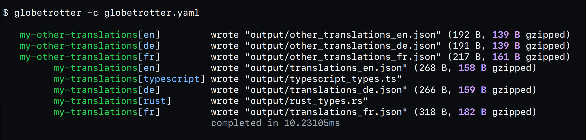

## globetrotter

[](https://github.com/LuupSystems/globetrotter/actions/workflows/build.yaml)
[](https://github.com/LuupSystems/globetrotter/actions/workflows/test.yaml)
[](https://deps.rs/repo/github/LuupSystems/globetrotter)
[](https://docs.rs/globetrotter)
[](https://crates.io/crates/globetrotter)

Type-safe internationalization through code generation. Define translations once, use them everywhere with full type safety across multiple programming languages.

<p align="center">
  
</p>

### Why globetrotter

Most i18n solutions force you to choose between type safety and runtime flexibility. Globetrotter provides both by separating concerns: translation data is stored as pure JSON and loaded dynamically at runtime, while type definitions are generated at build time and shared across all language files.

This architecture enables:

- **Compile-time safety**: Catch missing translations and incorrect arguments before deployment
- **Runtime flexibility**: Load translations dynamically without rebuilding your application
- **Polyglot consistency**: The same type definitions work across Rust, TypeScript, and other supported languages
- **Zero runtime overhead**: Types exist only at compile time; runtime uses plain JSON

### How it works

1. Define translations in TOML with explicit argument types
2. Generate language-specific type definitions and JSON files
3. Include types at build time, load JSON dynamically at runtime
4. Use translations with full IDE autocomplete and type checking

The key insight: translation keys and their argument signatures are known at build time, even though the actual translated strings are loaded dynamically.

### Installation

```bash
brew install --cask LuupSystems/tap/globetrotter

# Or install from source
cargo install --locked globetrotter-cli
```

### Configuration

Create a `globetrotter.yaml` file in your project root:

```yaml
version: 1
configs:
  my-translations:
    # Define which languages you support
    languages: ["en", "de", "fr"]
    
    # Template engine for interpolation (handlebars or none)
    engine: handlebars
    
    # Strict mode: fail on missing translations
    strict: true
    
    # Validate templates at build time
    check_templates: true
    
    # Input translation files (TOML format)
    inputs:
      - path: ./translations/common.toml
        prefix: "common"           # Optional: namespace translations
        prepend_filename: true     # Optional: use filename as prefix
      
      - path: ./translations/errors.toml
        prefix: "errors"
    
    # Output files
    outputs:
      # JSON files for runtime (one per language)
      json:
        - ./dist/translations_{{language}}.json
      
      # TypeScript type definitions
      typescript:
        type: ./src/generated/translations.ts
      
      # Rust type definitions
      rust:
        - ./src/generated/translations.rs
      
      # Additional language support
      golang:
        - ./generated/translations.go
      python:
        - ./generated/translations.py
```

### Defining translations

Create TOML files with your translations:

```toml
# translations/common.toml

[greeting]
en = "Hello {{name}}"
de = "Hallo {{name}}"
fr = "Bonjour {{name}}"
arguments = { name = "string" }

[item_count]
en = "You have {{count}} items"
de = "Du hast {{count}} Elemente"
fr = "Vous avez {{count}} éléments"
arguments = { count = "number" }

[welcome]
en = "Welcome to our application"
de = "Willkommen in unserer Anwendung"
fr = "Bienvenue dans notre application"
```

### Generating types

Run globetrotter to generate type definitions and JSON files:

```bash
# Generate from config file in current directory
globetrotter

# Specify config file explicitly
globetrotter --config globetrotter.yaml

# Dry run to preview changes
globetrotter --dry-run
```

### Usage in Rust

```rust
use serde_json;

// Include generated types at compile time
mod translations {
    include!(concat!(env!("OUT_DIR"), "/translations.rs"));
}
use translations::Translation;

// Load JSON dynamically at runtime
let json = std::fs::read_to_string("translations_en.json")?;
let translations: globetrotter_model::json::Translations = 
    serde_json::from_str(&json)?;

// Use with full type safety
let greeting = Translation::CommonGreeting { 
    name: "Alice" 
};

// The key is statically known
let key = greeting.key(); // "common.greeting"

// Render with your template engine
let message = handlebars.render(key, &greeting)?;
// Result: "Hello Alice"
```

For a complete working example, see `examples/example-rust/` in this repository:

```bash
cd examples/example-rust
cargo run -- --language en --name "Alice"
# Output: Hello Alice

cargo run -- --language de --name "Alice"
# Output: Hallo Alice
```

The example demonstrates:
- Using a `build.rs` script to generate types and JSON at compile time
- Loading JSON dynamically at runtime
- Rendering translations with Handlebars templates
- Full type safety with the generated `Translation` enum


### Usage in TypeScript

```typescript
// Import generated types (included at build time)
import type { Translations } from './generated/translations';

// Load JSON dynamically at runtime
async function loadTranslations(lang: string): Promise<Translations> {
  const response = await fetch(`/translations_${lang}.json`);
  return response.json();
}

// Use with full type safety and autocomplete
const translations = await loadTranslations('en');

// TypeScript knows the exact structure
const greeting = translations['common.greeting'];

// For templates with arguments, types are enforced
type GreetingArgs = { name: string };
const message = renderTemplate(greeting, { name: 'Alice' });
// Result: "Hello Alice"

// TypeScript will error if you use wrong argument types
// renderTemplate(greeting, { name: 123 }); // ❌ Type error
```

### Supported languages

Globetrotter currently generates type-safe bindings for:

- **Rust** - Full enum-based type safety with serde integration
- **TypeScript** - Type definitions with template argument validation

**Waiting for contributions:**
- **Go, Python, C++, C#, Dart, Elixir, Java, Kotlin, Lua, PHP, Ruby, Swift, Zig**

Globetrotter's modular architecture makes it straightforward to add support for new languages. Each language generator is an independent crate that implements a simple interface. See the [library documentation](https://docs.rs/globetrotter) to contribute a generator for your language.

All languages share the same JSON format at runtime, ensuring consistency across your stack.

### Template engines

- **Handlebars** - Full Handlebars syntax with custom helpers
- **Bring your own template engine**!
    
    The architecture supports pluggable template engines. Contributions for additional engines are welcome.

### Contributing

Contributions are welcome, especially for new language generators. See the [library documentation](https://docs.rs/globetrotter) for implementation details.
